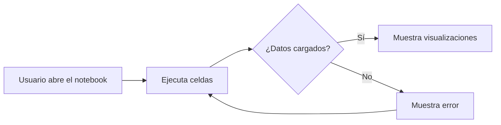

# 🚀 SpaceX Data Analysis


---

## 📋 Tabla de contenidos

- [Descripción](#-descripción)
- [Características](#-características)
- [Tecnologías](#-tecnologías)
- [Instalación](#-instalación)
- [Uso](#-uso)
- [Estructura](#-estructura-del-proyecto)
- [Lo que aprendí](#-lo-que-aprendí)
- [Mejoras futuras](#-mejoras-futuras)
- [Autor](#-autor)

---

## 📖 Descripción

Este proyecto analiza datos de SpaceX, incluyendo lanzamientos, cohetes, y plataformas de lanzamiento. Está diseñado para estudiantes y entusiastas de la ciencia de datos que deseen explorar datos reales y aprender sobre procesamiento de datos. Fue creado para practicar habilidades de análisis y visualización de datos.

---

## ✨ Características

- ✅ Análisis de datos de lanzamientos
- ✅ Visualización de datos clave
- ✅ Integración con datos reales de SpaceX
- ✅ Diseño modular
- ✅ Documentación clara

---

## 🛠️ Tecnologías

| Tecnología | Para qué |
|------------|----------|
| Python     | Procesamiento y análisis de datos |
| Jupyter    | Entorno interactivo para análisis |
| Pandas     | Manipulación de datos |
| Matplotlib | Visualización de datos |
| JSON       | Almacenamiento de datos |

---

## ⚙️ Instalación

```bash
# 1. Clonar el repositorio
git clone https://github.com/tu-usuario/spacex-data-analysis.git

# 2. Entrar en la carpeta
cd spacex-data-analysis

# 3. Abrir el notebook en Jupyter
jupyter notebook clase_spacex.ipynb
```

---

## 💡 Uso

1. Abre el archivo `clase_spacex.ipynb` en Jupyter Notebook.
2. Ejecuta las celdas paso a paso para analizar los datos.
3. Explora los resultados visuales y las estadísticas generadas.

---

## 📁 Estructura del proyecto

```
spacex-data-analysis/
├── clase_spacex.ipynb
├── data/
│   └── spacex_cache/
│       ├── latest_launch.json
│       ├── launches.json
│       ├── launchpads.json
│       ├── payloads.json
│       └── rockets.json
└── README.md
```

---

## 🔄 Flujo de la aplicación



---

## 🎓 Lo que aprendí

- Cómo trabajar con datos JSON en Python.
- Visualización de datos con Matplotlib.
- Organización de proyectos de análisis de datos.

---

## 🚧 Mejoras futuras

- [ ] Añadir análisis de tendencias históricas.
- [ ] Integrar datos de otras agencias espaciales.
- [ ] Crear un dashboard interactivo.
- [ ] Añadir más visualizaciones avanzadas.

---

## 👤 Autor

**Nicole Escobar**

- 🐙 GitHub: [@nicol-ael](https://github.com/nicol-ael)
- 💼 LinkedIn: [Nicole Escobar](https://www.linkedin.com/in/nicolescobardatayhealthcare/)
- ✉️ Email: nicolescobar3330@gmail.com